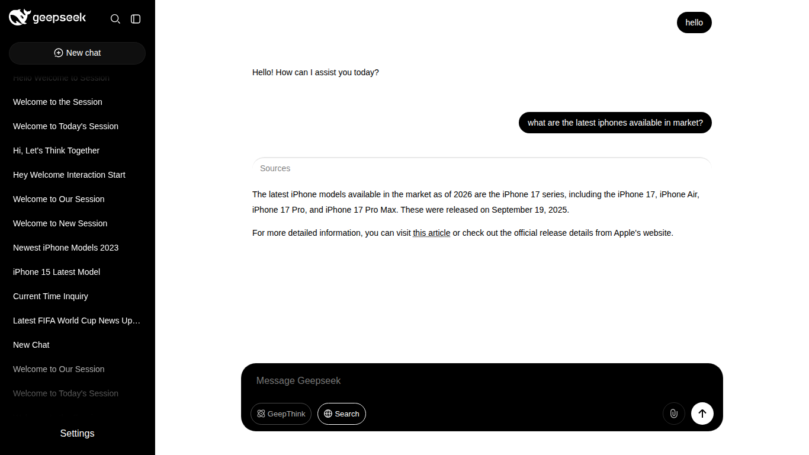

# GeepSeek

GeepSeek is a conversational AI application with optional web search and extended reasoning. It separates the user interface from the API backend and persists chat history locally in SQLite.

.png)

## Features

- Multi-turn chat with session history
- Optional **Search** mode with retrieval-augmented generation (RAG)
- Optional **GeepThink** mode for extended model reasoning
- Streaming responses over Server-Sent Events (SSE)
- OpenAI-compatible LLM endpoints (Ollama, cloud APIs, and similar providers)

## Quick start

See [Quick Start](quick_start.md) for environment setup, model configuration, and first run.

## Documentation

| Document | Description |
|----------|-------------|
| [Overview](documentation/Overview.md) | System architecture and request flow |
| [Client](documentation/Client.md) | Web UI and routing |
| [Server](documentation/Server.md) | API, agents, and streaming |
| [Data](documentation/Data.md) | SQLite schemas and persistence |
| [Search tools](app/server/search/search.md) | Web search tool definitions and integration |

## Requirements

- Python 3.10+
- An OpenAI-compatible inference endpoint

Install dependencies from the repository root:

```bash
pip install -r requirements.txt
```

Copy `.env.example` to `.env` and set your model endpoint and credentials.

## Running the application

Start the API server (port 5000):

```bash
python app/server/server.py
```

Start the web client (port 5001):

```bash
python app/client/serv.py
```

Open [http://127.0.0.1:5001/chat/new](http://127.0.0.1:5001/chat/new) in your browser.

## Screenshots

.png)

.png)

## License

See the repository for license terms.
