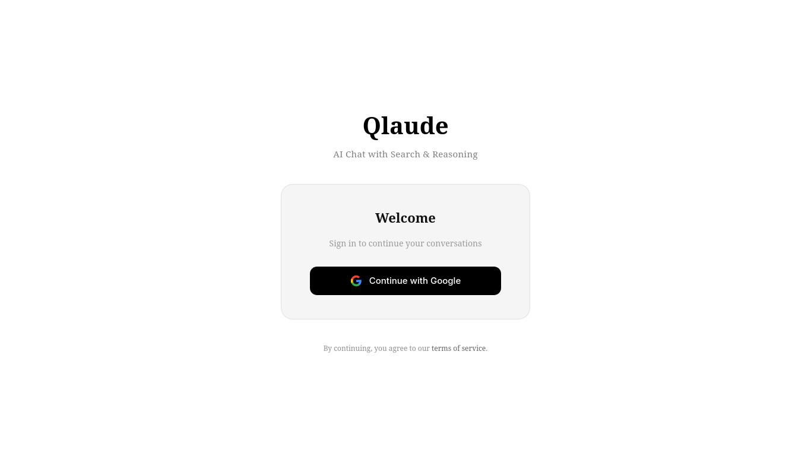
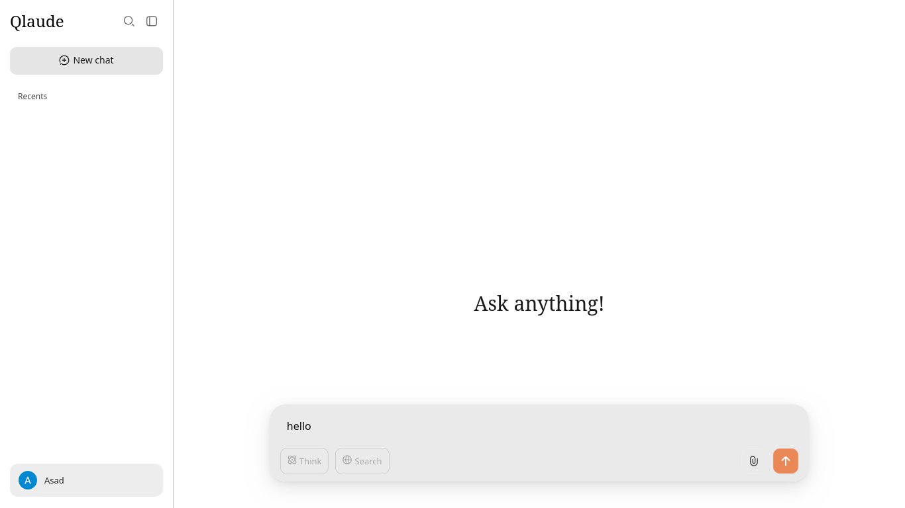
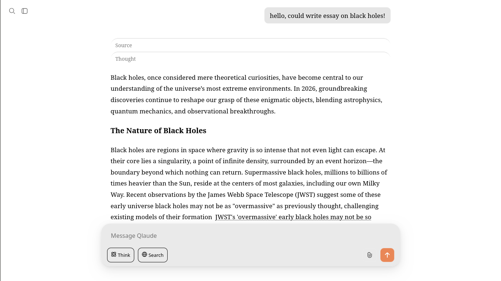
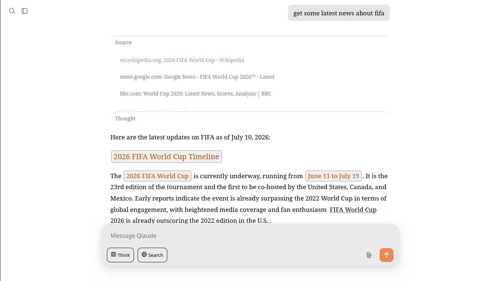
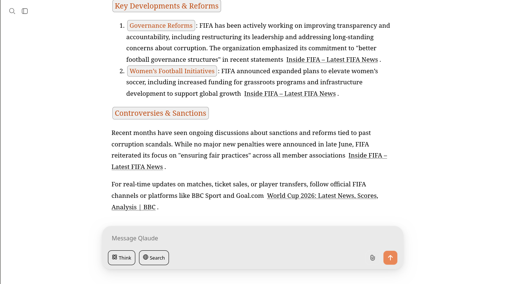
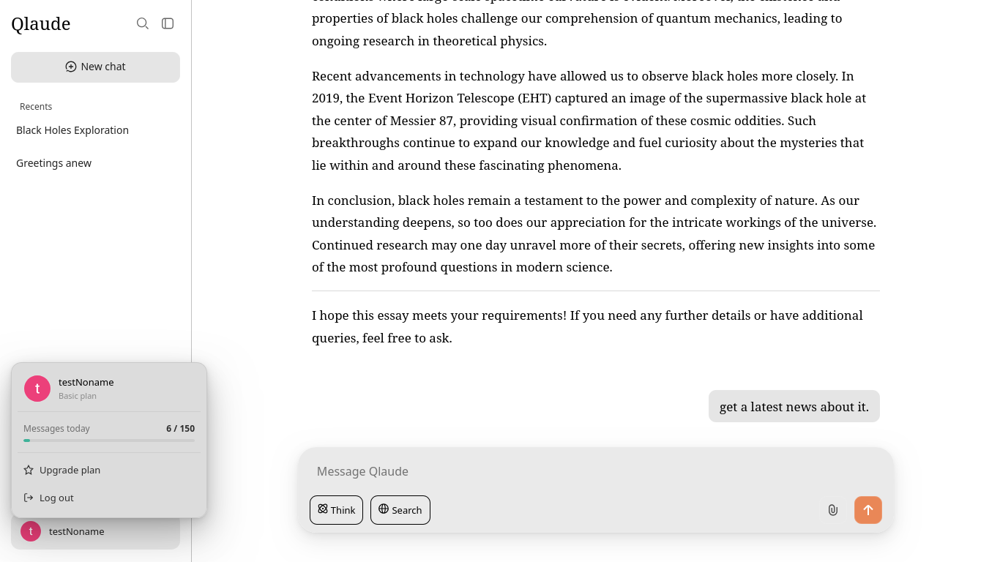
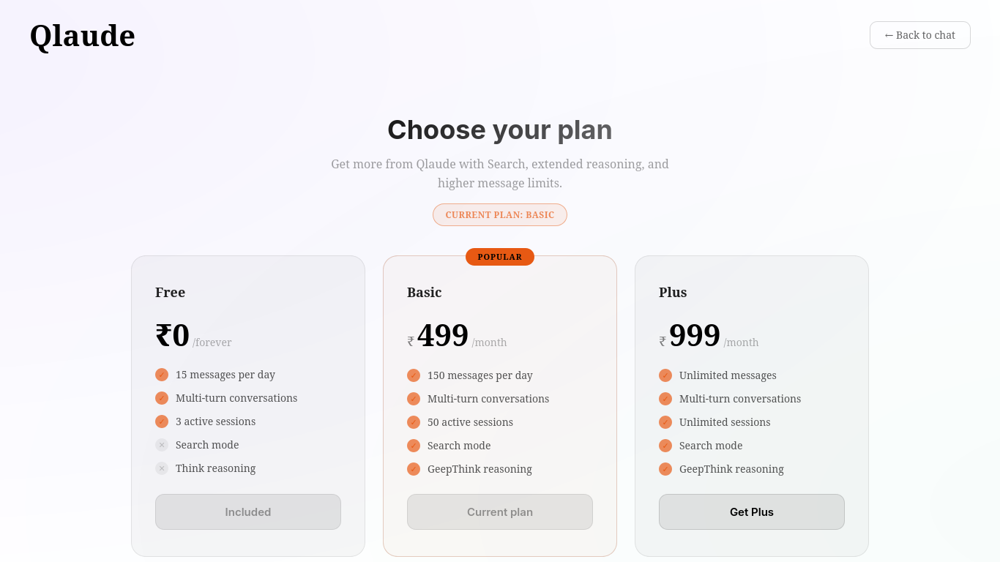

# Qlaude

Qlaude is a premier Conversational AI SaaS platform designed for high-performance reasoning and real-time web search capabilities. Built for scale, it provides a seamless, subscription-based experience with advanced retrieval-augmented generation (RAG) and extended model reasoning.

## 🎥 Preview Video

here is [Preview video](documentation/assets/video.mp4)

## 📸 Screenshots









## Features

- **Enterprise-Grade AI Chat**: Multi-turn conversational interface with persistent sessions
- **Think Reasoning Engine**: Advanced mode for deep, extended model reasoning to solve complex problems
- **Real-Time Web Search**: Integrated RAG pipeline using real-time search data to ground model responses
- **Subscription Management**: Integrated with Stripe for seamless billing, tiered usage quotas, and automated access control
- **High-Performance Streaming**: Real-time token streaming over Server-Sent Events (SSE) for low-latency responses
- **Flexible LLM Backend**: Compatible with leading OpenAI-format endpoints, ensuring scalable AI inference

##  Documentation

| Document | Description |
|----------|-------------|
| [Architecture Overview](documentation/Overview.md) | SaaS architecture, microservices, and request lifecycle |
| [Client Application](documentation/Client.md) | Frontend web UI and routing |
| [API Server](documentation/Server.md) | Core backend, AI agents, and SSE streaming |
| [Data Management](documentation/Data.md) | Database schemas and data persistence strategies |
| [Payments & Billing](documentation/Payments.md) | Stripe integration, subscription tiers, and quota enforcement |
| [Authentication](documentation/Auth.md) | OAuth 2.0 implementation and identity management |
| [Search Infrastructure](app/server/search/search.md) | Web search integrations and RAG tools |

## Subscription Tiers

| Tier | Price | Daily Interactions | RAG Search | Think Reasoning | Concurrent Sessions |
|------|-------|-------------------|------------|-----------------|---------------------|
| **Free** | ₹0 | 15 | ❌ | ❌ | 3 |
| **Basic** | ₹499/mo | 150 | ✅ | ✅ | 50 |
| **Plus** | ₹999/mo | Unlimited | ✅ | ✅ | Unlimited |

## Quick Start

### Prerequisites

- Python 3.10+
- Stripe Account (for billing integration)
- Google Cloud Console Project (for OAuth)
- OpenAI-compatible inference endpoint

### Installation

1. Clone the repository:
```bash
git clone https://github.com/bravecoconut/qlaude.git
cd qlaude
```

2. Install dependencies:
```bash
pip install -r requirements.txt
```

3. Configure environment variables:
```bash
cp .env.example .env
```

Edit `.env` and add your credentials:
- `BASE_URL` - Your OpenAI-compatible inference endpoint
- `API_KEY` - Your API key for the inference endpoint
- `RESONNING_MODEL` - Model identifier for Think mode
- `NON_RESONNING_MODEL` - Default model identifier
- `GOOGLE_CLIENT_ID` - Google OAuth client ID
- `GOOGLE_CLIENT_SECRET` - Google OAuth client secret
- `STRIPE_PUBLISHABLE_KEY` - Stripe publishable key
- `STRIPE_SECRET_KEY` - Stripe secret key
- `STRIPE_BASIC_PRICE_ID` - Stripe Basic plan price ID
- `STRIPE_PLUS_PRICE_ID` - Stripe Plus plan price ID
- `STRIPE_WEBHOOK_SECRET` - Stripe webhook secret
- `FLASK_SECRET_KEY` - Flask session encryption key

### Running the Platform

1. Start the core API microservice (port 5000):
```bash
python app/server/server.py
```

2. Start the frontend client application (port 5001):
```bash
python app/client/serv.py
```

3. For local Stripe testing, start the webhook listener:
```bash
stripe listen --forward-to http://127.0.0.1:5001/stripe/webhook
```

4. Access the platform at [http://127.0.0.1:5001/chat/new](http://127.0.0.1:5001/chat/new)

## Architecture

Qlaude operates on a modern, decoupled SaaS architecture:

- **Frontend Client** (`app/client/`) - Flask web service serving the chat UI on port 5001
- **Core API** (`app/server/`) - REST API handling AI inference, search, and streaming on port 5000
- **Data Layer** (`app/data/`) - SQLite databases for users, sessions, and chat histories

## Database Initialization

The platform automatically creates all necessary databases and tables on first startup:

- `users.db` - User accounts, subscriptions, and usage tracking
- `session_info.db` - Session metadata and workspace organization
- `database.db` - Chat message histories (with per-session tables)
- `chat_comment.db` - UI placeholder content

No manual database setup is required.

## Development

### Project Structure

```
Qlaude/
├── app/
│   ├── client/          # Frontend web application
│   │   ├── static/      # CSS, JS, images
│   │   ├── templates/   # HTML templates
│   │   └── serv.py      # Flask client server
│   ├── server/          # Core API backend
│   │   ├── search/      # RAG search integration
│   │   ├── main_manager.py  # Session management
│   │   ├── search_agent.py  # Search orchestration
│   │   └── server.py    # Flask API server
│   └── data/            # Data persistence layer
│       └── user_manager.py  # User & subscription management
├── sql/                 # Database schemas
├── documentation/       # Technical documentation
├── assets/              # Screenshots and media
└── requirements.txt     # Python dependencies
```

## Contributing

Contributions are welcome! Please feel free to submit a Pull Request.


## 🙏 Acknowledgments

- Built with Flask and OpenAI-compatible APIs
- Powered by Stripe for subscription management
- Uses Google OAuth 2.0 for authentication
- Search integration via DuckDuckGo and trafilatura
